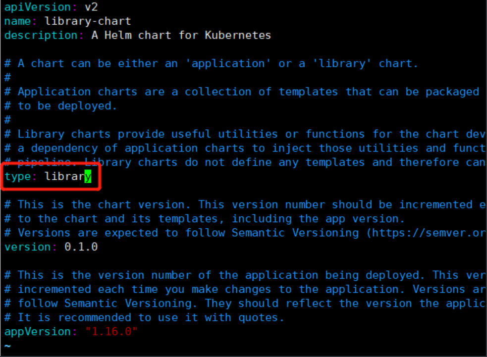

# 概述
Helm 是 Kubernetes 的包管理器，您也可以在 `CNCF Helm` 项目过程报告阅读详细的背景信息。

Helm如同大多数的编排工具一样，入门简单，但是深入起来比较复杂。

本文将介绍helm的一些高级用法，掌握了以下内容，将会更有效的使用helm。

## 精简Template文件

### 使用使用命名模板
看一个demo
```yaml
{{- define "test-chart.labels" -}}
{{- if .Chart.AppVersion }}
app.kubernetes.io/version: {{ .Chart.AppVersion | quote }}
{{- end }}
app.kubernetes.io/managed-by: {{ .Release.Service }}
app.kubernetes.io/instance: {{ .Release.Name }}
{{- end }}
```
define 开启一个新的 命名模板，然后 "test-chart.labels" 是模板的名称。

模板的命名规则，推荐为：**$CHART_NAME.$THING_THE_TEMPLATE_CREATES**

"test-chart.labels" 根据上面命名规则就可以理解为：此命名模板在test-chart中，这个模板创建的是labels

命名模板与其余 Kubernetes 模板一起位于 templates/ 文件夹下。但是，它们很容易从常规模板中脱颖而出，因为定义命名模板的文件以下划线 (_) 为前缀并包含“.tpl”扩展名。最常用的文件名是 _helpers.tpl，但您可以使用任何其他名称并创建多个 tpl 文件。一个 tpl 文件可以包含一个或多个命名模板。

### 应用命名模板

命名模板是通过使用 include 函数应用的。include函数有以下两个参数：

1. 模板名称
2. 对象范围

查看示例

```yaml
apiVersion: apps/v1
kind: Deployment
metadata:
  labels:
    {{- include "test-chart.labels" . | indent 4 }}
  name: {{ .Release.Name }}
spec:
  ...
```

您通常会看到在管道中使用 include 来格式化输出。在这种情况下，输出通过管道缩进以缩进标签 4 个空格。结果如下所示：

```yaml
# Source: test-chart/templates/deployment.yaml
apiVersion: apps/v1
kind: Deployment
metadata:
  labels:    
    app.kubernetes.io/version: "1.16.0"
    app.kubernetes.io/managed-by: Helm
    app.kubernetes.io/instance: my-test
  name: my-test
spec:
  ...
```

您可以使用此命名模板，通过将“include”调用添加到其他模板，为 Helm 图表管理的每个资源添加相同的标签。如果您需要修改标签，您可以在单个位置（命名模板定义）中执行此操作，而不必在每个资源中进行更改。

命名模板也可以调用其他命名模板，因为类似的事情也是可能的，其中“helm.sh/chart”标签是“test-chart.chartname”模板的结果。

```yaml
{{- define "test-chart.labels" -}}
helm.sh/chart: {{ include "test-chart.chartname" . }}
{{- if .Chart.AppVersion }}
app.kubernetes.io/version: {{ .Chart.AppVersion | quote }}
{{- end }}
app.kubernetes.io/managed-by: {{ .Release.Service }}
app.kubernetes.io/instance: {{ .Release.Name }}
{{- end }}
```

### 命名模板用例
我们探索了如何使用命名模板来创建一组标准的标签。但是，您可以使用命名模板实现更多的可能性。以下是您可以封装的常见模板的简短列表：

- Container spec
- Healthchecks
- Volumes/volumeMounts
- Selector labels
- Environment variables
- Ports/targetPorts
- Script boilerplate in ConfigMaps

每当您在两个或多个模板之间有公共代码时，您可以编写一个命名模板来分解该模板并简化charts维护。以下是使用多个命名模板的部署示例：

```yaml
apiVersion: apps/v1
kind: Deployment
metadata:
  name: {{ include "test-chart.fullname" . }}-frontend
  labels:
    {{- include "test-chart.labels" . | nindent 4 }}
spec:
  replicas: {{ .Values.frontendReplicas }}
  selector:
    matchLabels:
      app.kubernetes.io/name: {{ include "test-chart.name" . }}-frontend
  template:
    metadata:
      labels:
        app.kubernetes.io/name: {{ include "test-chart.name" . }}-frontend
    spec:
      {{- include "test-chart.serviceAccountName" . | nindent 6 }}
      containers:
        - name: {{ .Chart.Name }}
          image: {{ .Values.frontend.imageName }}:{{ .Values.frontend.imageTag }}
          {{- include "test-chart.healthchecks" . | nindent 10 }}
          {{- include "test-chart.resources" . | nindent 10 }}
      {{- include "test-chart.nodeselector" . | nindent 6 }}
```

在此示例中，命名模板替换了此前端部署和图表可能包含的其他部署之间的模板。特定于此前端部署的配置照常编写。命名模板无法删除所有涉及的 YAML，但它们可以更轻松地维护您希望在两个或多个资源之间共享的配置，并且它们提供了一个公共场所来编辑这些配置。

## 使用library charts

在上面，我们知道了如何使用命名模板来减少单个 Helmchart中的模板文件。现在，我们将通过讨论如何使用library charts来减少跨多个 Helm chart的模板文件。为此，我们将重点介绍library charts（库图表）的概念。

### 理解library charts

库图表是完全由命名模板组成的 Helm chart。正如在使用命名模板中了解的那样，命名模板是一个可重用的模板，其中包含chart资源通用的template。我们在上面描述的命名模板是在名为 _helpers.tpl 的文件中定义的，并且仅对它所属的 Helm chart可见。 library chart通过包含命名模板来进行扩展，您的 Helm 图表可以通过将库图表声明为依赖项来使用这些命名模板。

### 创建library charts

创建library charts类似于创建常规helm chart。

```bash
[root@k8s-master helm]# helm create library-chart
Creating library-chart
[root@k8s-master helm]# tree library-chart/ -L 1
library-chart/
├── charts
├── Chart.yaml
├── templates
└── values.yaml

2 directories, 2 files
[root@k8s-master helm]# rm -rf library-chart/charts/ library-chart/values.yaml 
[root@k8s-master helm]# 
[root@k8s-master helm]# 
[root@k8s-master helm]# tree library-chart/ -L 1
library-chart/
├── Chart.yaml
└── templates

1 directory, 1 file
[root@k8s-master helm]# 

```

这是library chart的基本结构：

```bash
library-chart/
├── Chart.yaml
└── templates
```

很简单！**请注意，library chart不包含 values.yaml 文件**，因为应用程序chart负责提供该文件。

然后要确保 Chart.yaml 中的类型设置是library以将其与普通应用程序图表区分开来

我们将Chart.yaml中的类型修改一下

原配置如下

```bash
[root@k8s-master helm]# vim library-chart/Chart.yaml 

apiVersion: v2
name: library-chart
description: A Helm chart for Kubernetes

# A chart can be either an 'application' or a 'library' chart.
#
# Application charts are a collection of templates that can be packaged into versioned archives
# to be deployed.
#
# Library charts provide useful utilities or functions for the chart developer. They're included as
# a dependency of application charts to inject those utilities and functions into the rendering
# pipeline. Library charts do not define any templates and therefore cannot be deployed.
type: application

# This is the chart version. This version number should be incremented each time you make changes
# to the chart and its templates, including the app version.
# Versions are expected to follow Semantic Versioning (https://semver.org/)
version: 0.1.0

# This is the version number of the application being deployed. This version number should be
# incremented each time you make changes to the application. Versions are not expected to
# follow Semantic Versioning. They should reflect the version the application is using.
# It is recommended to use it with quotes.
appVersion: "1.16.0"

```

如上：type: application，类型为application。

我们修改为library


```yaml
apiVersion: v2
name: library-chart
description: A Helm chart for Kubernetes
type: library
version: 0.1.0
appVersion: "1.16.0"
```
您命名的模板将位于 templates/ 文件夹下。您可以通过使用单个 _helpers.tpl 文件来构建它.其实我们结合“使用命名模板”这块的说明，我们就知道 命名模板 是放在templates目录下<u>以下划线 为前缀、以.tpl 为后缀的任意命名文件</u></u>。 如下所示：

```bash
[root@k8s-master library-chart]# tree templates/ -L 1
templates/
└── _helpers.tpl

0 directories, 1 file
```

但是，我认为当您将命名模板拆分为多个文件并根据其用途命名每个 tpl 文件时，库图表更易于维护。例如，您可能有这样的结构：

```bash
templates/
  _name.tpl # For setting resource names
  _labels.tpl # For adding labels to each resource
  _volumes.tpl # For adding volumes and volumeMounts
  ...
```

每个 tpl 文件的内容包含一个或多个命名模板定义。假设 _labels.tpl 文件用于在每个 Helm chart中创建一组通用模板。在此文件中，您可以编写以下模板：

```bash
{{- define "library-chart.labels" -}}
{{- if .Chart.AppVersion }}
app.kubernetes.io/version: {{ .Chart.AppVersion | quote }}
{{- end }}
app.kubernetes.io/managed-by: {{ .Release.Service }}
app.kubernetes.io/instance: {{ .Release.Name }}
{{- end }}
```

然后，在您的应用程序图表中，您可以包含此命名模板以生成它包含的样板。让我们在下一节中更深入地了解这一点。

### 使用library charts

要使用库图表中定义的命名模板，您需要通过在应用程序图表的 Chart.yaml 文件中将其声明为依赖项来导入它。您将在依赖项部分下提供库图表的名称、版本和存储库。下面是应用chart依赖library chart的写法。

写法一：

```yaml
apiVersion: v2
name: nginx
version: 1.0.0
dependencies:
  - name: library-chart
    version: 1.0.0
    repository: https://my-chart-repo.example.com/
```

有时，将库图表作为本地文件路径引用会更方便。在这种情况下，以下声明可能更容易维护：

```yaml
apiVersion: v2
name: nginx
version: 1.0.0
dependencies:
  - name: library-chart
    version: 1.0.0
    repository: file://../library-chart
```

将库图表声明为依赖项后，请务必运行 helm dependency update 命令以导入图表。执行 helm dependency update后，它会将library chart 的 tgz包导入到 charts目录下。

```bash
→ helm dependency update nginx
Hang tight while we grab the latest from your chart repositories...
...
Update Complete. ⎈Happy Helming!⎈
Saving 1 charts
Deleting outdated charts
```

导入库图表后，您可以使用库图表中定义的每个命名模板。这是在示例 nginx 图表中使用上面的库图表“library-chart.labels”模板的示例：

```yaml
apiVersion: apps/v1
kind: Deployment
metadata:
  name: {{ .Release.Name }}
  labels:
    {{- include "library-chart.labels" . | indent 4 }}
spec:
  replicas: 1
  selector:
    matchLabels:
      {{- include "library-chart.labels" . | indent 6 }}
  template:
    metadata:
      labels:
        {{- include "library-chart.labels" . | indent 8 }}
    spec:
      containers:
        - name: {{ .Release.Name }}
          image: {{ .Values.image }}:{{ .Values.tag }}
```

如您所见，使用库图表有助于减少chart template，它还为您提供了一个单独的地方来管理每个chart的配置。以上面的标签为例。通过使用library chart，您可以轻松管理添加到 Kubernetes 资源的每个标签。如果您需要更改这些标签，您可以通过在库图表中进行快速更改来轻松更新多个 Helm 图表。

我们已经讨论了如何使用命名模板和库图表来帮助封装template文件。在下一节中，我想讨论如何使用库图表来封装整个 Kubernetes 资源。

### 使用library charts封装 Kubernetes 资源

可以帮助您减少更多template文件的第二个选项是编写一个封装整个部署的命名模板。下面是一个例子：

```yaml
{{- define "library-chart.deployment" -}}
apiVersion: apps/v1
kind: Deployment
metadata:
  name: {{ .Release.Name }}
  labels:
    {{- include "library-chart.labels" . | indent 4 }}
spec:
  replicas: {{ .Values.replicas }}
  selector:
    matchLabels:
      {{- include "library-chart.labels" . | indent 6 }}
  template:
    metadata:
      labels:
        {{- include "library-chart.labels" . | indent 8 }}
    spec:
      containers:
        - name: {{ .Release.Name }}
          image: {{ .Values.image.name }}:{{ .Values.image.tag }}
{{- end }}
```

然后，您的应用程序图表可以使用单个“包含”调用轻松创建部署：

```bash
{{ include "library-chart.deployment" . }}
```

就是这样！由于部署样板是在您的库图表中捕获的，因此您只需要一行即可创建整个部署。现在所需要做的就是让用户提供“replicas”、“image.name”和“image.tag”值，或者让您在图表的 values.yaml 文件中为这些设置默认值。

您在使用库图表时可能会遇到的一个挑战是了解每个命名模板所需的值，尤其是当它们变得更大且可能更复杂时。在下一节中，我想介绍一个我喜欢用来简化库图表使用的解决方案，即将您的库图表编写为基于契约的。

### 编写基于契约的library charts

基于契约的库图表的概念类似于 Java 接口背后的思想。在 Java 接口中，您定义继承类必须实现的每个方法。为了用 Helm 来描述这一点，您的库图表应该需要它期望的每个值，并且继承的应用程序图表应该在 values.yaml 中提供默认值或期望用户自己提供它们。

让我们来看一个示例，使用与之前相同的模板，但始终使用**required**函数来要求输入。

```yaml
{{- define "library-chart.deployment" -}}
apiVersion: apps/v1
kind: Deployment
metadata:
  name: {{ .Release.Name }}
  labels:
    {{- include "library-chart.labels" . | indent 4 }}
spec:
  replicas: {{ required "value 'replicas' is required" .Values.replicas }}
  selector:
    matchLabels:
      {{- include "library-chart.labels" . | indent 6 }}
  template:
    metadata:
      labels:
        {{- include "library-chart.labels" . | indent 8 }}
    spec:
      containers:
        - name: {{ .Release.Name }}
          image: {{ required "value 'image.name' is required" .Values.image.name }}:{{ required "value 'image.tag' is required" .Values.image.tag }}
{{- end }}
```

如您所见，此命名模板现在需要“replicas”、“image.name”和“image.tag”值。如果有人试图在他们的应用程序图表中实现这个命名模板，但没有这些值，他们会得到这个错误：

```bash
Error: execution error at (nginx/templates/deployment.yaml:1:3): value 'replicas' is required
```

以及每个未实现的值的类似错误。通过添加这些要求，您已经在您的库图表和所有想要实现其命名模板的图表之间创建了一个契约。

从那里，应用程序图表维护者可以做出决定。他们可以在 values.yaml 文件中默认每个必需的值，或者他们可以不实现它们并强制用户必须自己提供它们。在这种情况下，假设您希望在应用程序图表的 values.yaml 文件中默认每个值，因此您可以将这些值中的每一个添加到您的values.yaml文件中。

## 在Helm中编写基于函数的模板
Named templates可以看作函数，既然是函数，那么就可以给函数传参。使用 （dict “key” “value” ...）就可以给命名模板传参。

```go
apiVersion: apps/v1
kind: Deployment
metadata:
  name: {{ include "test-chart.fullname" . }}-frontend
  labels:
    {{- include "test-chart.labels" . | nindent 4 }}
spec:
  replicas: {{ .Values.frontendReplicas }}
  selector:
    matchLabels:
 app.kubernetes.io/name: {{ include "test-chart.name" . }}-frontend
  template:
    metadata:
      labels:
 app.kubernetes.io/name: {{ include "test-chart.name" . }}-frontend
    spec:
      {{- include "test-chart.serviceAccountName" . | nindent 6 }}
      containers:
        - name: {{ .Chart.Name }}
          image: {{ .Values.frontend.imageName }}:{{ .Values.frontend.imageTag }}
          {{- include "test-chart.healthchecks" | nindent 10 }}
          {{- include "test-chart.resources | nindent 10 }}
 {{- include "test-chart.nodeselector" . | nindent 6 }}
```

如果您只有几个部署，上面的模板非常棒。您可以根据需要复制粘贴模板并更新字段。但是，假设您在 Helm 图表中部署了一个相当大的堆栈，其中包含 3 个或更多部署。突然之间，复制粘贴的想法听起来不太好。想象一下，您可以编写一个灵活且可重用的模板来捕获整个部署，这样您就可以通过编写一行来创建部署，而不是复制粘贴上面的内容：

```go
{{ include “test-chart.deployment” (dict “root” . “component” .Values.frontend) }}
```

让我们看一个示例，说明如何编写用于创建部署的基于函数的命名模板：

```go
{{- define "test-chart.deployment" -}}
apiVersion: apps/v1
kind: Deployment
metadata:
  name: {{ include "test-chart.fullname" .root }}-{{ .component.name }}
  labels:
    {{- include "test-chart.labels" .root | nindent 4 }}
spec:
  replicas: {{ .component.replicas }}
  selector:
    matchLabels:
 app.kubernetes.io/name: {{ include "test-chart.name" .root }}-{{ .component.name }}
  template:
    metadata:
      labels:
 app.kubernetes.io/name: {{ include "test-chart.name" .root }}-{{ .component.name }}
    spec:
      {{- include "test-chart.serviceAccountName" .root | nindent 6 }}
      containers:
        - name: {{ .component.name }}
          image: {{ .component.imageName }}:{{ .component.imageTag }}
          {{- include "test-chart.healthchecks" .root | nindent 10 }}
          {{- include "test-chart.resources" .root | nindent 10 }}
      {{- include "test-chart.nodeselector" .root | nindent 6 }}
{{- end -}}
```

**<u>.root 代表根范围。根范围通常由点 (.) 或美元符号 ($) 表示</u>**!

调用基于函数的 Helm 模板

valus.yaml

```yaml
frontend:
  name: frontend
  imageName: example/frontend
  imageTag: “1.0”
backend:
  name: backend
  imageName: example/backend
  imageTag: “1.0”  
```

当我们创建前端的deployment时，可以使用以下去调用named template：

```go
{{ include “test-chart.deployment” (dict “root” . “component” .Values.frontend) }}
```

当我们创建后端的deployment时，可以使用以下去调用named template：

```go
{{ include “test-chart.deployment” (dict “root” . “component” .Values.backend) }}
```

## 参考

[How To Reduce Helm Chart Boilerplate With Named Templates](https://austindewey.com/2020/08/09/how-to-reduce-helm-chart-boilerplate-with-named-templates/)

[How To Reduce Helm Chart Boilerplate With Library Charts](https://austindewey.com/2020/08/17/how-to-reduce-helm-chart-boilerplate-with-library-charts/)

[Writing Function-Based Templates In Helm](https://austindewey.com/2021/06/02/writing-function-based-templates-in-helm/)
